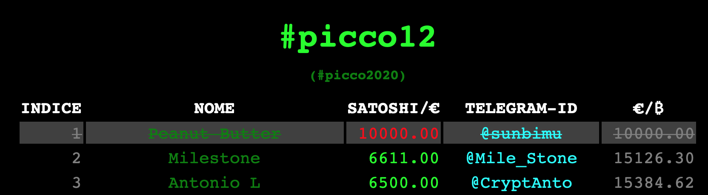

# #picco12

- [#picco12](#picco12)
	- [URL](#url)
	- [Finalità](#finalità)
	- [Storia](#storia)
	- [Edizione `#picco12`](#edizione-picco12)
	- [Lingua ufficiale](#lingua-ufficiale)
	- [Rischi](#rischi)
	- [Come partecipare](#come-partecipare)
	- [Prezzo partecipazione](#prezzo-partecipazione)
	- [Partecipazione anonima](#partecipazione-anonima)
	- [Partecipazione firmata](#partecipazione-firmata)
	- [Premio per il vincitore](#premio-per-il-vincitore)
		- [NON_PREMIO (aggiunto in #picco14)](#non_premio-aggiunto-in-picco14)
	- [Dettagli tecnici](#dettagli-tecnici)
		- [Vanilla-JS](#vanilla-js)
		- [Database dei concorrenti](#database-dei-concorrenti)
		- [Picco](#picco)
		- [Linter xo](#linter-xo)
		- [Commit firmate](#commit-firmate)
		- [Certificazione temporale - Opentimestamps](#certificazione-temporale---opentimestamps)
	- [Donazioni](#donazioni)

## URL
* Repository su GitHub: https://github.com/isghe/picco-bitcoin
* Pagina web:
	* https://isghe.github.io/picco-bitcoin/
	* https://tinyurl.com/picco12
* Paginetta per convertire da `€/₿` a `satoshi/€` e viceversa [satoshieuro-eurobitcoin_converter](https://isghe.github.io/satoshieuro-eurobitcoin_converter/)

## Finalità
Stimare il picco massimo di bitcoin, nel 12 AG (Anno Genesi) fra il 3 gennaio 2020 18.15 UTC e il 3 gennaio 2021 18.14 UTC.

## Storia
Il gioco è nato sul gruppo telegram [Bitcoin Italia](https://t.me/bitcoinIta) a fine 2016, quando la quotazione di 1000 €/₿ era per alcuni un miraggio, da un'idea di Guido Baroncini Turicchia, servito e manutenuto nelle edizioni `#picco2017`, `#picco2018` e `#picco2019` su un foglio elettronico in `google docs` [#picco2019](http://tinyurl.com/picco2019).

Le edizioni del `#picco2017`, `#picco2018` comprendevano il periodo dal primo dell'anno all'ultimo dell'anno, e le stime venivano effettuate in €/₿.

Nell'edizione `#picco2019`, sono state introdotte due grosse novità:
* periodo dal 3 gennaio 2019 18.15 UTC al 3 gennaio 2020 18.15 UTC;
* stima in unità di cambio `satoshi/€`

In tutte e tre le edizioni `#picco2017`, `picco2019`e `#picco2019` viene proclamato vincitore, chi si avvicina di più (quindi sia in eccesso che in difetto) al picco registrato nel periodo temporale della competizione; ed il premio per il vincitore era un gelato offerto da Guido Baroncini Turicchia.

## Edizione `#picco12`

Introduce i seguenti cambiamenti:
* Viene servito e manutenuto con `git`, reso pubblicamente disponibile sulla piattaforma `GitHub` come pagina web statica;
* Si svolge nel periodo temporale che va dal 3 gennaio 2020 18.15 UTC al 3 gennaio 2021 18.14 UTC;
* Viene denominato `#picco12` perché si svolgerà nell'Anno Genesi (AG) 12 dal blocco genesi di Bitcoin.
* Vince chi si avvicina di più in difetto alla quotazione minima in unità di conto `satoshi/€`. Chi `sfora` anche di una sola frazione di satoshi, viene eliminato; ad esempio se bitcoin dovesse essere quotato 9999 satoshi/€, qualunque giocatore con stima superiore (quindi ad esempio 10000 o 9999.01 satoshi/€) verrebbe eliminato. I concorrenti eliminati vengono evidenziati con un'appropriata rappresentazione grafica, ad esempio:

## Lingua ufficiale
La lingua ufficiale, della competizione `#picco12` è la lingua Italiana.
Sono bene accette ed auspicabili, traduzioni in altre lingue, ma la lingua di riferimento, in caso di controversie, resta quella Italiana.

## Rischi
Tutti i partecipanti alla competizione `#picco12` sono consapevoli che:
* Essendo il codice sorgente, e la base dati [data12.js](data12.js), aperti e distribuiti, NON è attuabile il diritto all'oblio.

Tutti gli osservatori (anche non partecipanti alla competizione) sono avvisati che:
* Le stime dichiarate (firmate o no che siano) da qualuque partecipante alla competizione, NON devono essere prese in alcun modo, come consigli finanziari; nessuno ha una `sfera di cristallo` e nessuno sa predirre il futuro. Ed anzi, proprio l'enorme volatilità nelle stime, dovrebbe volutamente lasciare intendere, quanto la quotazione futura di Bitcoin, sia davvero imprevedibile.
* Il software pubblicato, è stato scritto per gioco, svago e divertimento; NON deve essere utilizzato in ambienti di produzione, e nel caso venisse utilizzato, il tutto sarebbe a proprio rischio e pericolo, di chi lo utlizza.

## Come partecipare
Per partecipare alla competizione `#picco12`, bisogna rendere pubblica, entro il 3 gennaio 2020 18.14 UTC, la propria stima in unità di cambio `satoshi/€`, nei gruppi telegram [Bitcoin Italia](https://t.me/bitcoinIta) o [Bitcoin Gateways](https://t.me/bitcoinIta_Gateways), mediante i tag `#picco12` o `#picco2020` con a seguire la stima in `satoshi/€`, oppure effettuando una PR firmata, con l'aggiunta della propria stima al file [data12.js](data12.js). Le stime possono anche essermi inviate con altri strumenti di comunicazione, che considererò di volta in volta validi oppure no.

## Prezzo partecipazione
La partecipazione è gratuita.

## Partecipazione anonima
Sono consentite partecipazioni anonime o farlocche, a patto che i nomignoli o avatar utilizzati, non offendano (a mio unico ed insindacabile giudizio) il comune senso del pudore o decenza.

## Partecipazione firmata
Sono consentite tramite PR firmata al file [data12.js](data12.js) di questo stesso Repository.
I firmatari attuali della propria stima sono:
* `Isidoro Ghezzi ⚡️`: [f38fad388da19757180e89b8762154cf1c62c7b0](https://github.com/isghe/picco-bitcoin/commit/f38fad388da19757180e89b8762154cf1c62c7b0)
* `Ma͛rtiño 🐟`: https://github.com/isghe/picco-bitcoin/commit/f38fad388da19757180e89b8762154cf1c62c7b0#commitcomment-36592916
* `Alekos Filini`: https://github.com/isghe/picco-bitcoin/pull/1

## Premio per il vincitore
Non è previsto alcun premio, giacché in questo gioco al massacro, tutti i partecipanti sperano di perdere, per eliminazione.

### NON_PREMIO (aggiunto in #picco14)
Pur non essendo previsto alcun premio per il vincitore, in ogni modo il `NON_PREMIO` è unico ed indivisibile… mica siamo alle olimpiadi di Tokyo 2020, in cui nel salto in alto, sono stati moltiplicati gli ori!)

## Dettagli tecnici
https://isghe.github.io/picco-bitcoin/ è una pagina web html statica. Il codice in `index.html` è il codice minimalista `html`, per caricare i file `p12.png` (l'icona che appare nel browser), gli stili in `index.css`, il database dei concorrenti in `data12.js` e finalmente il codice JavaScript in `index.js`.

### Vanilla-JS

Il codice in JavaScript è un [vanilla-js](http://vanilla-js.com), quindi JavaScript puro, senza l'utilizzo di alcun framework o library; tutti gli elementi `dom` vengono creati runtime in JavaScript:
* NO TypeScript;
* NO jQuery;
* NO AngularJS;
* NO ReactJS;

### Database dei concorrenti
Il database dei concorrenti, contenuto in `data12.js`, è un JSON assegnato alla costante globale `gData`; viene aggiornato a `manina` via via che i concorrenti chiedono di inserire la propria stima, e `pushato` su `github`.

### Picco
Il `picco` minimo raggiunto, in unità di cambio `satoshi/€`, viene anch'esso aggiornato a manina, nel campo `self.model.minValue` del file `index.js`.

### Linter xo
Prima della pubblicazione su `github` viene effettuato un controllo sintattico tramite il `linter` [xo](https://github.com/xojs/xo).

### Commit firmate
Ogni commit viene crittograficamente firmata, con la mia chiave pubblica, la cui impronta crittografica è: `06A1 72EB ED3E 6F59 5233  1984 971E 1F79 80BB 3DEB`

### Certificazione temporale - Opentimestamps
Ogni commit viene `certificata temporalmente` tramite [opentimestamps](https://opentimestamps.org) su `Bitcoin`.

## Donazioni
Ogni donazione è benvenuta all'indirizzo Bitcoin: `1p12pYog8jxVL3QaqevM4Gp32MZUoutck`
